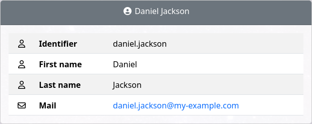
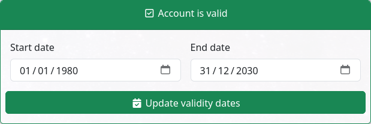

Display parameters
==================

User panel
----------

Configure which items are displayed:

.. code-block:: php

     $display_items = array('identifier', 'firstname', 'lastname', 'title', 'businesscategory', 'employeenumber', 'employeetype', 'mail', 'phone', 'mobile', 'fax', 'postaladdress', 'street', 'postalcode', 'l', 'state', 'organizationalunit', 'organization');

Set which item is use as title:

.. code-block:: php

     $display_title = "fullname";

Choose to show undefined values:

.. code-block:: php

     $display_show_undefined = false;

Account information panel
-------------------------

.. image:: images/ltb_sd_account_information.png

Configure which items are displayed:

.. code-block:: php

    $display_password_items = array('pwdchangedtime', 'pwdreset', 'pwdaccountlockedtime', 'pwdfailuretime','pwdpolicysubentry', 'authtimestamp', 'created', 'modified');

You can also display the password expiration date in this panel by enabling this option:

.. code-block:: php

    $display_password_expiration_date = true;

Lock status
-----------

You can disable the lock status panel:

.. code-block:: php

    $show_lockstatus = false;

Enable status
-------------

.. image:: images/ltb_sd_enable_status.png

You can disable the enable status panel:

.. code-block:: php

    $show_enablestatus = false;

Expire status
-------------

You can disable the expire status panel:

.. code-block:: php

    $show_expirestatus = false;

Validity status
---------------

You can disable the validity status panel:

.. code-block:: php

    $show_validitytatus = false;
