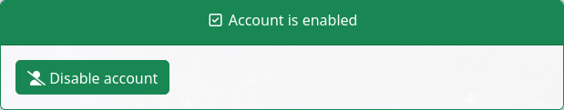

Enable and disable account
==========================

Show enabled status
-------------------

Service Desk will display if account is enabled or not. To allow this feature:

.. code-block:: php

    $show_enablestatus = true;

Enable account
--------------

This feature allows to enable the account. The button is only displayed if the account is disabled.

To enable this feature:

.. code-block:: php

    $use_enableaccount = true;

Disable account
---------------

This feature allows to disable the account. It is only displayed if the account is enabled.

To enable this feature:

.. code-block:: php

    $use_disableaccount = true;

Insert comment
--------------

This feature displays a comment pop-up when enabling and disabling user accounts.

To enable this feature:

.. code-block:: php

    $use_enablecomment = true;
    $use_disablecomment = true;

Comment required
----------------

This feature ensures a comment is required before enabling/disabling a user.

.. code-block:: php

    $use_enablecomment_required = true;
    $use_disablecomment_required = true;
