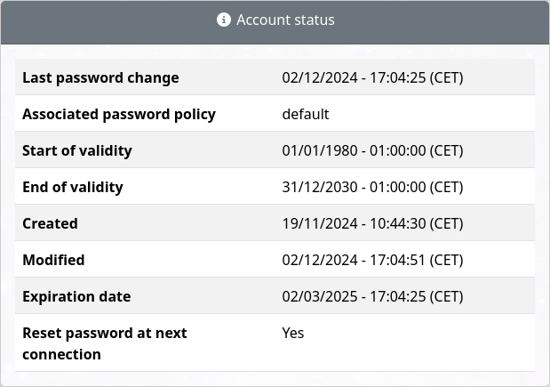

.. Service Desk documentation master file, created by
   sphinx-quickstart on Sat Mar 28 22:56:37 2020.
   You can adapt this file completely to your liking, but it should at least
   contain the root `toctree` directive.

LDAP Tool Box Service Desk documentation
========================================

.. toctree::
   :maxdepth: 2
   :caption: Contents

   presentation.rst
   installation.rst
   upgrade.rst
   configuration-apache.rst
   configuration-nginx.rst
   general-parameters.rst
   ldap-parameters.rst
   ppolicy.rst
   attributes.rst
   search-parameters.rst
   display-parameters.rst
   checkpassword.rst
   resetpassword.rst
   lockaccount.rst
   enableaccount.rst
   updatestartendtime.rst
   hook.rst
   customization.rst
   dashboards.rst
   configuration-mail.rst
   audit.rst
   createentry.rst
   renameentry.rst
   updateentry.rst
   deleteentry.rst
