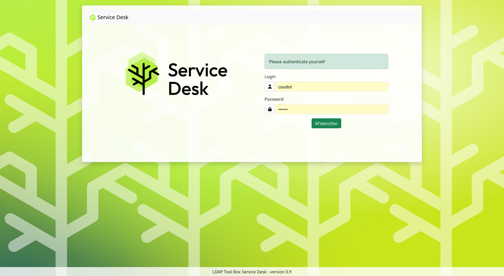
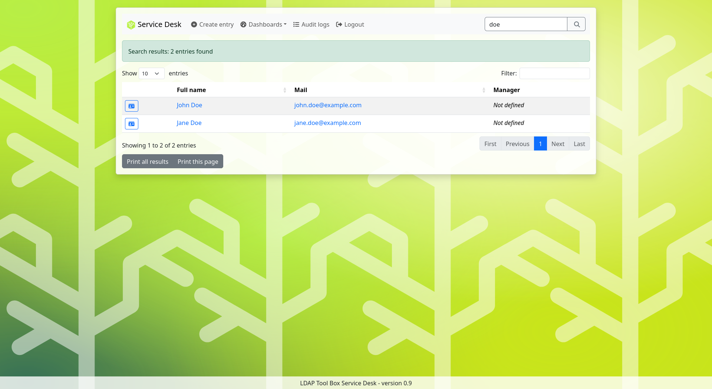
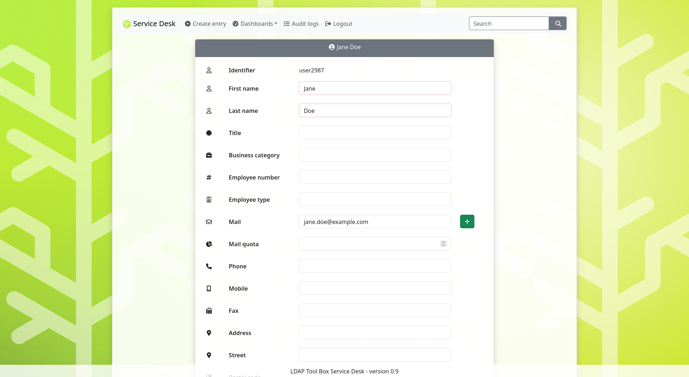

Presentation
============

LDAP Tool Box Service Desk is a web application for administrators and support teams.
It allows to manage accounts in an LDAP directory, view and update their status.

Features
--------

* LDAPv3 and Active Directory support
* Authentication with LDAP or SSO (HTTP header)
* Quick search for an account
* Create, update, rename and delete accounts
* Add or remove users from groups (group membership)
* View main attributes
* View account and password status
* Test current password
* Reset password and force password change at next connection
* Lock and unlock account
* Enable and disable account
* Update account validity dates
* Create and view audit logs
* Set a comment on each action
* Launch a prehook and a posthook for each action
* Dashboards:

  * All accounts
  * Accounts locked
  * Accounts disabled
  * Accounts with a password that will soon expire
  * Accounts with an expired password
  * Accounts idle (never connected or not connected since a number of days)
  * Accounts invalid (for which start date is in the future, or end date is in the past)

