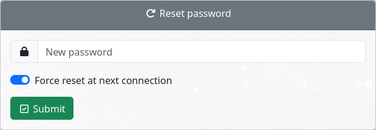

Reset password
==============

This feature allows to reset a password and set the reset at next connection flag.

To enable this feature:

.. code-block:: php

    $use_resetpassword = true;

When changing the password, you can force the user to reset it at next connection. To configure the default value presented in the form:

.. code-block:: php

    $resetpassword_reset_default = true;

If you do not want to let the choice to reset at next connection, you can hide this button:

.. code-block:: php

    $use_resetpassword_resetchoice = false;

In this case, the value set in ``$resetpassword_reset_default`` will be applied.

Notify user by mail
-------------------

You can notify the user by mail when the password is reset:

.. code-block:: php

   $notify_on_change = true;

To do so you need to configure mail (see :ref:`config_mail`).

Notify administrator by mail
----------------------------

$notify_admin_by_mail_list is a a php array list of mails of admins to set directly in service-desk configuration.

$header_name_notify_admin_by_mail is name of header that will be provided to cgi script as HTTP_$header_name_notify_admin_by_mail to set administrator mail from webserver.
This setting allows webserver to select an administrator mail related to current http session.
Its value should be a valid mail according to rfc822

If those are set any administrator mail will receive a notification that user password was changed.

Remark this is not controled by $notify_on_change, which is only for user.

.. code-block:: php

   $notify_admin_by_mail_list=array( 'a@example.com','b@example.com' 'c@example.com');
   $header_name_notify_admin_by_mail=SD_ADMIN_MAIL;

To do so you need to configure mail (see :ref:`config_mail`).
